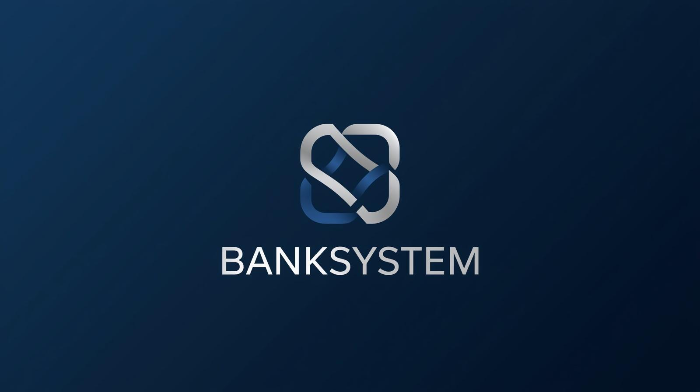
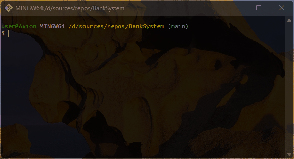

# 🏧 BankSystem
A bank status management system based on the Abstraction principle of OOP

## 💻 About Program
*Working on Balance with Regular and Credit Cards*                         
*Tasks:*
- *Deposit money*
- *Withdraw money*

### 🪟 Preview                                                  

### ⚙️ Technologies
 

## 🧑‍💻 I worked on it
- *OOP tools: classes, objects, constructors, methods*
- *OOP principles: Encapsulation, Inheritance, Abstraction, Polymorphism*
- *Data types: string, decimal*
- *Conditional statements: if else, ternary operator*
- *String types: Regular, Interpolation*
- *Keywords: abstract, virtual, override, base, this*

## 🤝 Future development
*Writing the authZ part of the accounts and preparing some options*